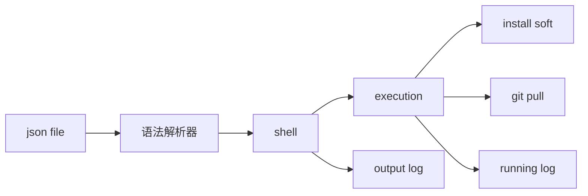

# Sisyphus

我苦于每一次的重装系统，在重装系统之后我需要安装大量的软件和恢复数据。

我希望这个事情可以自动化的来做，或者简化他。

我想到了西西弗斯，那个推石头的男人。

我需要西西弗斯帮我在每一次重装系统之后帮助我安装大量的软件和恢复数据。

## 技术栈：

1. 使用json定义step。
2. python搭建流程解析器
3. 多端的执行器，python，或者输出shell。

